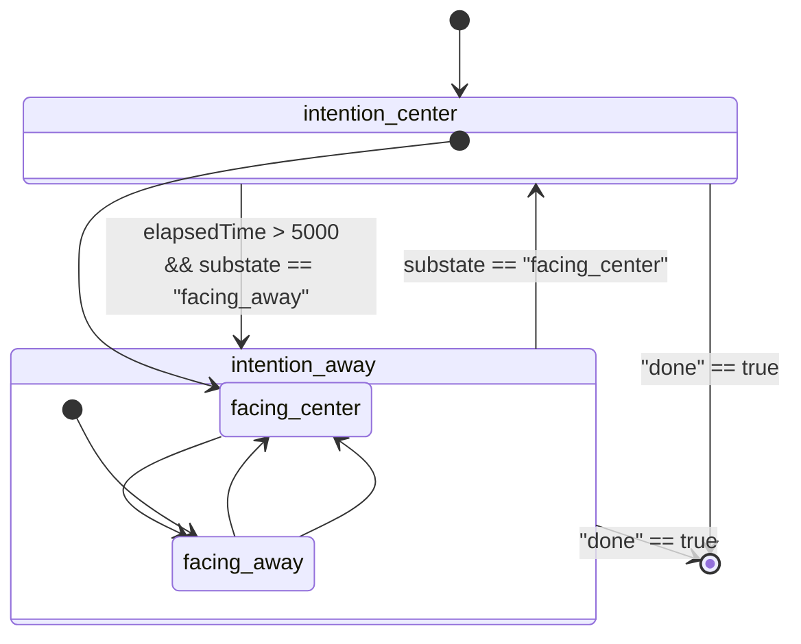

# callbag-fsm

A pausable & listenable callbag that sends data generated from running a finite state machine.

```
npm install callbag-fsm
```

This [callbag](https://github.com/callbag/callbag) is designed to be used for sampling-based [model-based testing](https://github.com/dubzzz/fast-check/blob/master/documentation/1-Guides/HandsOnPropertyBased.md) (or [property-based testing](https://github.com/dubzzz/fast-check/blob/master/documentation/1-Guides/HandsOnPropertyBased.md)) of [reactive programs](https://gist.github.com/staltz/868e7e9bc2a7b8c1f754) (e.g., [ReactiveX](http://reactivex.io/), [flapjax](https://www.flapjax-lang.org/), [Functional reactive animation](https://dl.acm.org/doi/pdf/10.1145/258948.258973)).


This repo is a part of [interactive-program-repair](https://gitlab.com/mjyc/interactive-program-repair).

## Examples

```javascript
const { run, subscribe } = require('callbag-fsm');

const source = run(s => (s === "S1" ? "S2"), "S1");

subscribe({next: console.log})(source); // S1
                                        // S2
                                        // S1
                                        // S2
                                        // .
                                        // .
                                        // .
```

## Demo

Generating simulated sensor inputs

```
npm install;
node demo.js;  // print out results
```

from a simulated human running the following fsm:


_if you can't see an image, click [here](https://gitlab.com/mjyc/callbag-fsm#demo)._

Visualizing generated sensor data:

```
node demo.js > viz/src/data.json
cd viz;
npm install;
pr start;
```
