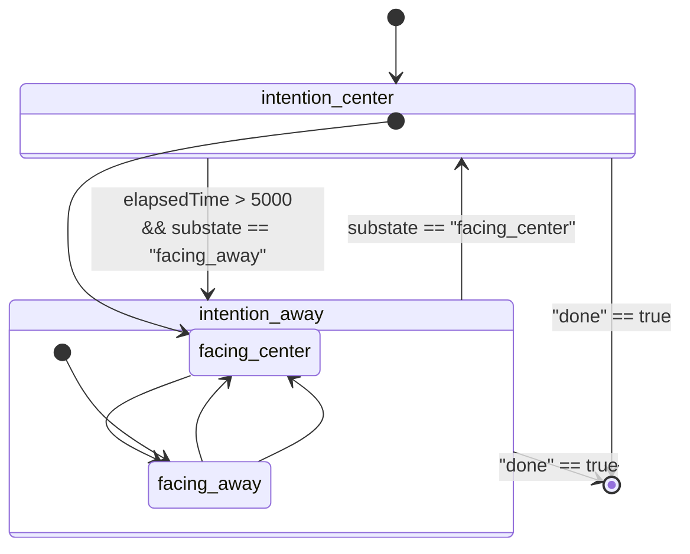

# callbag-fsm

A pausable & listenable callbag that sends data generated from running a finite state machine

```
npm install callbag-fsm
```

This repo is a part of [interactive-program-repair](https://gitlab.com/mjyc/interactive-program-repair).

## Examples

```javascript
const { run, subscribe } = require('callbag-fsm');

const source = run(s => (s === "S1" ? "S2"), "S1");

subscribe({next: console.log})(source); // S1
                                        // S2
                                        // S1
                                        // S2
                                        // .
                                        // .
                                        // .
```

## Demo

Generating simulated sensor inputs

```
npm install;
node demo.js;  // print out results
```

from a simulated human running the following fsm:


_if you can't see an image, click [here](https://mermaid.ink/img/eyJjb2RlIjoic3RhdGVEaWFncmFtXG4gIFsqXSAtLT4gaW50ZW50aW9uX2NlbnRlclxuICBpbnRlbnRpb25fY2VudGVyIC0tPiBpbnRlbnRpb25fYXdheTogZWxhcHNlZFRpbWUgPiA1MDAwPGJyPiYmIHN1YnN0YXRlID09IFwiZmFjaW5nX2F3YXlcIlxuICBpbnRlbnRpb25fYXdheSAtLT4gaW50ZW50aW9uX2NlbnRlcjogc3Vic3RhdGUgPT0gXCJmYWNpbmdfY2VudGVyXCJcbiAgaW50ZW50aW9uX2NlbnRlciAtLT4gWypdOiBkcm9wQWZ0ZXJQcmVkaWNhdGUgPT0gdHJ1ZVxuICBpbnRlbnRpb25fYXdheSAtLT4gWypdOiBkcm9wQWZ0ZXJQcmVkaWNhdGUgPT0gdHJ1ZVxuXG4gIHN0YXRlIGludGVudGlvbl9jZW50ZXIge1xuICAgIFsqXSAtLT4gZmFjaW5nX2NlbnRlclxuICAgIGZhY2luZ19jZW50ZXIgLS0-IGZhY2luZ19hd2F5XG4gICAgZmFjaW5nX2F3YXkgLS0-IGZhY2luZ19jZW50ZXJcbiAgfVxuXG4gIHN0YXRlIGludGVudGlvbl9hd2F5IHtcbiAgICBbKl0gLS0-IGZhY2luZ19hd2F5XG4gICAgZmFjaW5nX2F3YXkgLS0-IGZhY2luZ19jZW50ZXJcbiAgfSIsIm1lcm1haWQiOnsidGhlbWUiOiJkZWZhdWx0In19)._

Visualizing generated sensor data:

```
node demo.js > viz/src/data.json
cd viz;
npm install;
pr start;
```
